# Newsletter Compliance — Role-Based Demo Playbook

**Module:** `newsletter_compliance`
**Companion app:** Odoo Email Marketing (`mass_mailing`) — all menus below live under **Email Marketing → Compliance**

This playbook is organized by **role**, and every role below is a real Access Rights group in the module (Settings → Users → a user → Access Rights tab, under the "Email Marketing" section). For each role it lists what the person can actually do, exactly where in the UI they do it, and a workflow diagram of the steps. Use it as a script to run a live, role-by-role walkthrough of the module.

---

## 1. Roles at a Glance

| # | Role (Access Rights field) | One-line mandate | Implies |
|---|---|---|---|
| 1 | **Newsletter Author** | Drafts campaign content | Newsletter User |
| 2 | **Content Approver** | Approves *what the email says* | Newsletter User |
| 3 | **Compliance Reviewer** | Approves *that the email is allowed to be sent* + runs preflight | Newsletter User |
| 4 | **Compliance Administrator** | Everything a Reviewer can do, plus configuration and controlled overrides | Compliance Reviewer |
| 5 | **Campaign Operator** | Starts/monitors/retries the actual send | Newsletter User |
| 6 | **Operations Administrator** | Everything an Operator can do, plus provider/dispatch configuration | Campaign Operator |
| 7 | **Privacy Officer** | Runs Data Subject Access Requests, owns retention policy | Newsletter User |
| 8 | **Legal Hold Administrator** | Freezes/unfreezes records under legal preservation | Newsletter User |
| 9 | **Compliance Audit Reviewer** | Read-only access to everything, for evidence reconstruction | *(none — standalone)* |

A single person can hold several of these at once (e.g. a small team's admin might be both Compliance Administrator and Privacy Officer) — the groups are independent toggles specifically so that doesn't force artificial role-splitting, while still letting you demo strict separation of duties (Author ≠ Approver, Approver ≠ Compliance Reviewer) with dedicated single-role demo users.

---

## 2. End-to-End Lifecycle — Who Hands Off to Whom

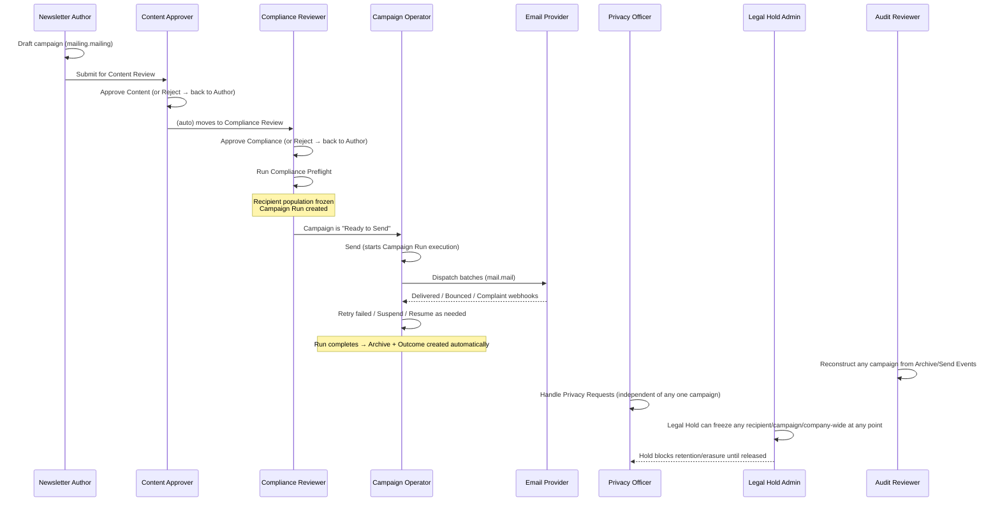

---

## 3. Role Playbooks

### 3.1 Newsletter Author

**Mandate:** owns campaign content end to end from a blank draft through submission. Cannot approve their own work — enforced in code, not just the UI (the "Campaign owners cannot approve their own content" check fires even via direct RPC).

| Task | Where | Steps |
|---|---|---|
| Create a new campaign | Email Marketing → *New* (top-left) | Fill Subject, Body, Brand, Consent Purpose, recipients (list or domain), From/Reply-To, physical address. Campaign starts in **Draft**. |
| Track your own campaigns | Compliance → Campaign Governance → **My Campaigns** | Filtered list of campaigns you authored, any state. |
| Submit for review | Open a Draft campaign → header button **"Submit for Content Review"** | Moves `compliance_state` from `draft` → `content_review`. Campaign now visible in the Content Approver's queue. |
| Withdraw/cancel a campaign you own | Open the campaign → **"Cancel Campaign"** wizard | Available to Author, Operator, and Compliance Admin. |

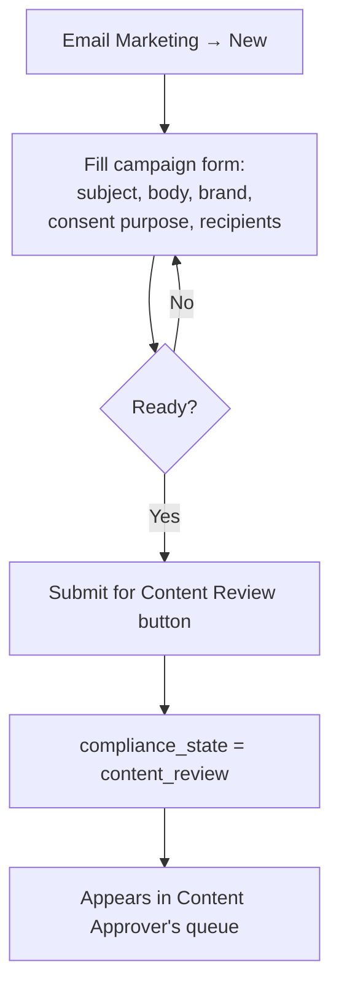

---

### 3.2 Content Approver

**Mandate:** reviews *what the message says* — subject, body, sender identity — independent of compliance/consent concerns.

| Task | Where | Steps |
|---|---|---|
| Work the content queue | Compliance → Campaign Governance → **Content Review Queue** | Lists every campaign in `content_review` state. |
| Approve content | Open a queued campaign → **"Approve Content"** | Blocked if you are the campaign's `business_owner_id` (self-approval prevention). Stamps `content_approved_by_id`/`_at`, moves state to `compliance_review`. |
| Reject content | Open a queued campaign → **"Reject"** (Reject Campaign wizard) | Requires a reason. Sends the campaign back toward Draft; approval history entry is kept (append-only). |
| Reset an invalidated campaign | Reset Campaign wizard | Used when a controlled field changed after approval and invalidated it — clears the invalidation so it can re-enter review. |

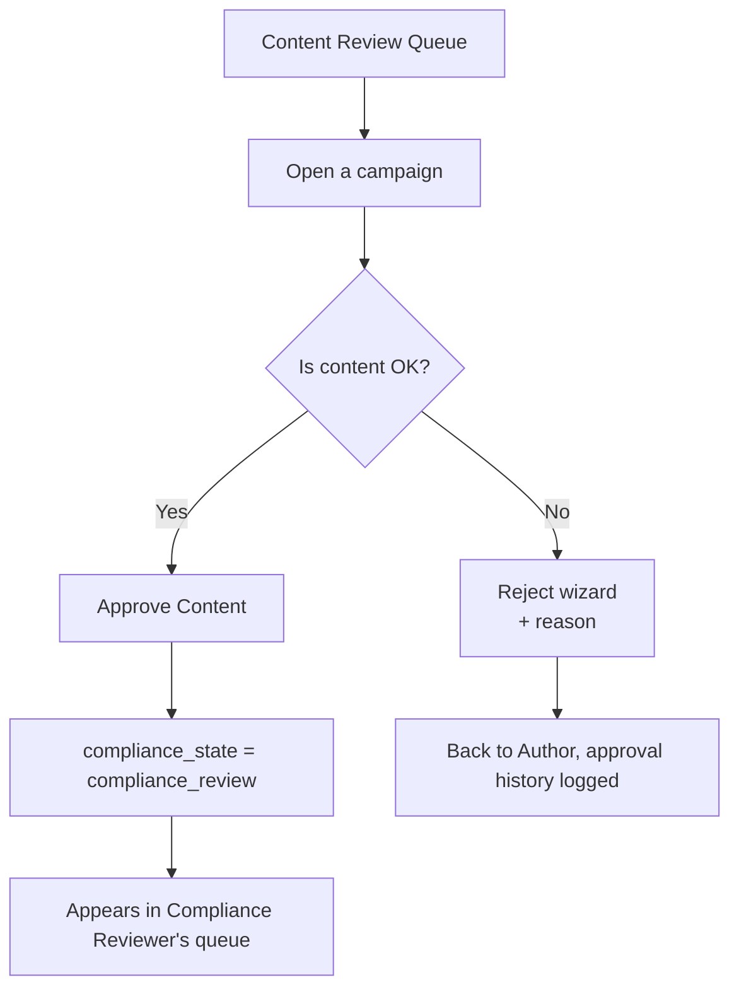

---

### 3.3 Compliance Reviewer

**Mandate:** the compliance gate — confirms consent purpose, brand, and legal metadata are correct, then runs the preflight that actually computes who is eligible to receive the send.

| Task | Where | Steps |
|---|---|---|
| Work the compliance queue | Compliance → Campaign Governance → **Compliance Review Queue** | Lists campaigns in `compliance_review` state. |
| Approve compliance | Open a queued campaign → **"Approve Compliance"** | Requires content approval to already exist. Stamps `compliance_approved_by_id`/`_at`, moves to `preflight_required`. |
| Reject compliance | Same campaign → **"Reject"** wizard | Same wizard as Content Approver uses; requires a reason. |
| Run preflight | Compliance → Campaign Governance → **Preflight Required** → open campaign → **"Run Compliance Preflight"** | Evaluates every candidate recipient against consent/suppression/blacklist/dedup rules, creates a `newsletter.campaign.run` + one `newsletter.recipient.eligibility` row per recipient, and **freezes** the eligible population. Campaign moves to `ready` (Ready to Send) only if preflight passes. |
| Inspect a preflight result | Compliance → Campaign Governance → **Ready to Send** / open the Run | Preflight tab shows targeted/eligible/excluded counts and the exclusion reason breakdown. |
| Review approval history | Compliance → Campaign Governance → **Approval History** | Append-only log of every content/compliance approval and rejection ever recorded, with content hash snapshots. |

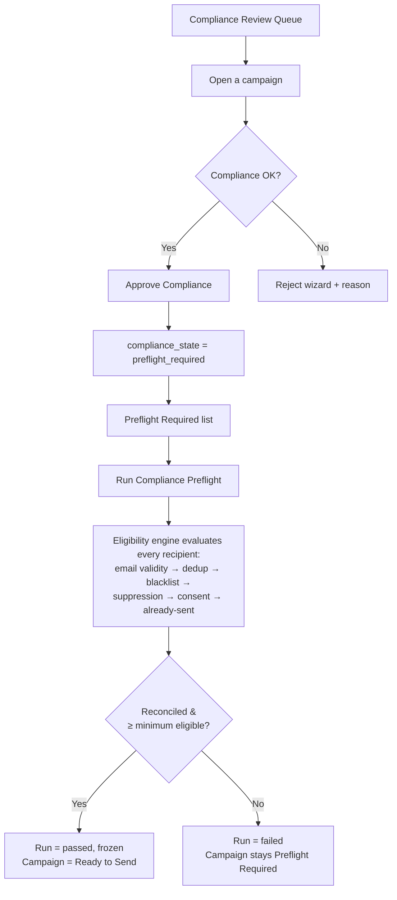

---

### 3.4 Compliance Administrator

**Mandate:** superset of Compliance Reviewer, plus module configuration and controlled emergency overrides (e.g. approving content in a pinch — still logged, still subject to the same checks otherwise).

| Task | Where | Steps |
|---|---|---|
| Everything a Compliance Reviewer can do | *(see §3.3)* | Same queues, same buttons — the Admin group is simply granted them too. |
| Configure Consent Purposes | Compliance → Configuration → **Consent Purposes** | Define the categories recipients consent to (e.g. "Product Updates", "Promotional Offers"). |
| Configure Suppression Reasons | Compliance → Configuration → **Suppression Reasons** | Seeded set (UNSUBSCRIBE, HARD_BOUNCE, COMPLAINT, GLOBAL_OPT_OUT, …) — admin can add/edit. |
| Configure Brands | Compliance → Configuration → **Brands** | Independent From/Reply-To/physical-address identities campaigns can be launched under. |
| Reinstate a suppressed contact | Compliance → Suppression → open an entry → **"Reinstate"** | Admin-only action; requires a reason; blocked entirely for non-reinstatable reasons like COMPLAINT. |
| Configure delivery/reputation/dispatch/retention settings | Compliance → Configuration → **Delivery & Reputation**, or Settings → General Settings → *Newsletter Deliverability* section | Bounce thresholds, retry backoff, preflight guards, provider webhook secrets, retention batch defaults — all in one settings page. |

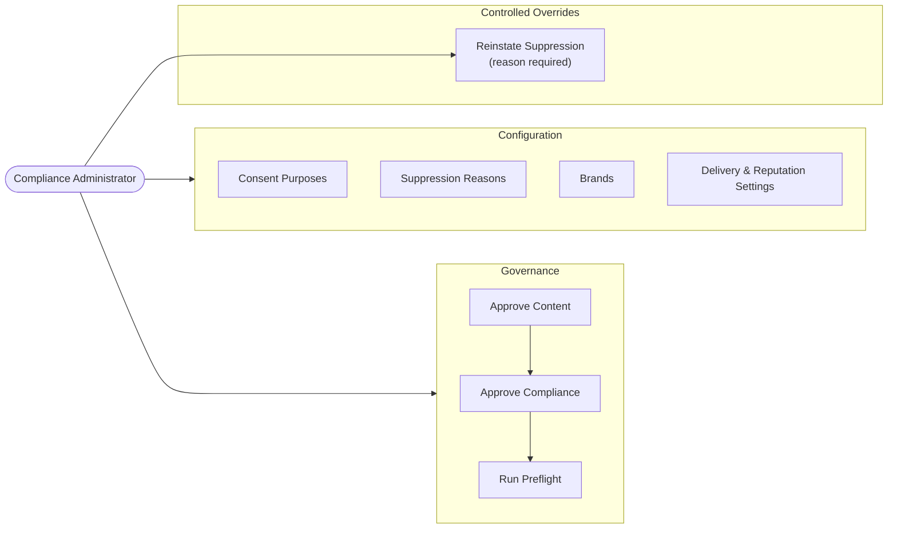

---

### 3.5 Campaign Operator

**Mandate:** turns a "Ready to Send" campaign into actual outbound email, and keeps the send healthy while it runs.

| Task | Where | Steps |
|---|---|---|
| Start a send | Compliance → Campaign Governance → **Ready to Send** → open the run → **"Send"** | Only enabled when the run is `passed` and `frozen`. Also blocked if the preflight is older than the configured max age. Creates a live `newsletter.campaign.outcome` for real-time bounce/complaint tracking. |
| Monitor active sends | Compliance → Execution → **Active Runs** | Runs currently `queued`/`sending`/`partially_completed`. |
| Suspend / Resume a send | Open a run → **"Suspend"** / **"Resume"** | Pauses dispatch without cancelling; useful when a bounce spike triggers concern mid-send. |
| Cancel a send | Open a run → **"Cancel Execution"** wizard | Terminates the run; already-sent recipients are untouched (no resend on any future rerun). |
| Retry failed recipients | Compliance → Execution → **Retry Pending** / **Failed Recipients**, or open the run → **"Retry Failed"** | Re-attempts only technically-failed sends (never compliance-blocked ones) with exponential backoff. |
| Review blocked-at-dispatch recipients | Compliance → Execution → **Dispatch Blocked** | Recipients whose consent/suppression status changed *between* preflight and the dispatch-time recheck — correctly `blocked`, not `failed`. |
| Review completed campaigns | Compliance → Execution → **Completed Runs** | Runs that finished and auto-archived. |

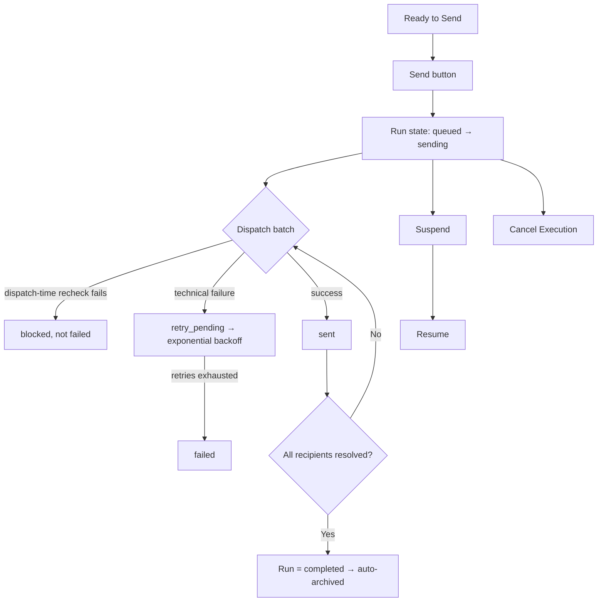

---

### 3.6 Operations Administrator

**Mandate:** superset of Campaign Operator, plus the technical configuration an operator shouldn't need to escalate to Compliance Administrator for.

| Task | Where | Steps |
|---|---|---|
| Everything a Campaign Operator can do | *(see §3.5)* | Same Execution menu, same buttons. |
| Configure delivery providers | Settings → General Settings → *Newsletter Deliverability* → **Delivery Provider** section | Webhook secrets/keys for the Generic, SMTP-relay, SES, SendGrid, and Mailgun adapters. |
| Configure dispatch/preflight/retention defaults | Same settings page → **Preflight** / **Dispatch** / **Retention** sections | Batch sizes, retry backoff, minimum eligible recipients, preflight staleness window, default retention batch size and dry-run posture. |

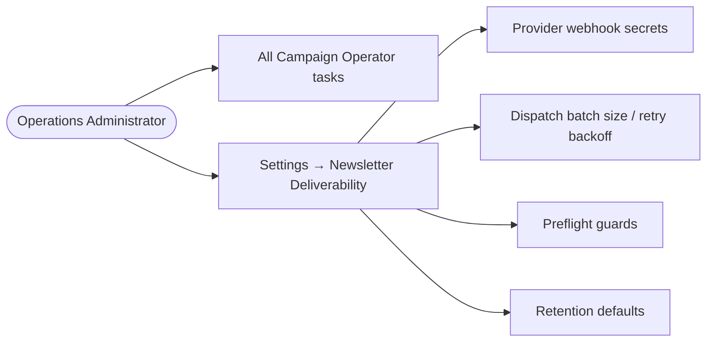

---

### 3.7 Privacy Officer

**Mandate:** runs the privacy program — Data Subject Access Requests end to end, plus the retention engine that keeps data from being held longer than necessary.

| Task | Where | Steps |
|---|---|---|
| Log a privacy request | Compliance → Privacy & Retention → **Privacy Requests** → *New* | Pick request type (access / export / correction / erasure / restriction / objection / consent history / marketing opt-out), link the partner or email. `due_at` auto-computes as `received_at + 30 days`. |
| Verify identity | Open the request → **"Verify Identity"** | Required before any erasure/restriction can execute. |
| Run discovery | Open the request → **"Run Discovery"** | Searches consent records, suppression entries (by partner *and* by pseudonymization hash), eligibility decisions, send events, provider events, and reputation for this subject — populates a JSON manifest + counts. |
| Decide | (model method `action_decide`, exposed via the record) | Fulfil / partially fulfil / reject, with a mandatory reason. |
| Execute | Open the request → **"Execute"** | For erasure/restriction: pseudonymizes what *can* be de-identified (suppression entries, eligibility decisions) while explicitly retaining regulatory evidence (consent records, send events) with a `retain` reason — never a silent delete. For access/export: just marks execution, nothing is mutated. |
| Mark complete | Open the request → **"Mark Completed"** | Blocked for erasure/restriction until at least one retention action was actually recorded. |
| Manage retention policies | Compliance → Privacy & Retention → **Retention Policies** | Per data-category rules: retention period, trigger, expiry action (retain/review/pseudonymize/anonymize/purge/delete), dry-run flag. |
| Preview a policy's impact | Open a policy → **"Preview Impact"** wizard | Dry-run only — shows what *would* happen, mutates nothing. |
| Run a policy manually (two-person control) | Open a policy → **"Run Now (Two-Person Control)"** wizard | Requires a distinct approver who holds Compliance Administrator — you cannot approve your own manual run. |
| Generate a recipient evidence package | From a Privacy Request → Audit Export wizard | Consolidated JSON of the subject's consent/suppression/eligibility/send history, masked by default. |
| Generate a campaign audit package | Compliance → Audit → **Audit Exports**, or from a Campaign Run | Full evidentiary package (governance, approvals, preflight, execution, outcome, integrity) with a SHA-256 file hash; auto-expires per the configured retention. |

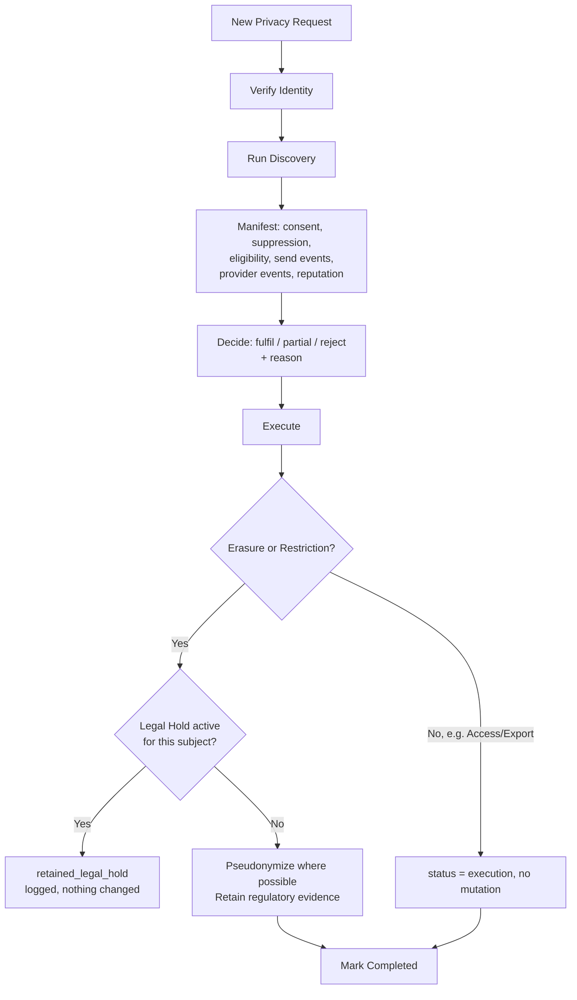

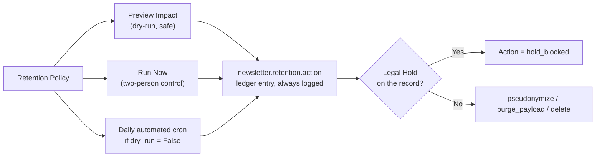

---

### 3.8 Legal Hold Administrator

**Mandate:** the override authority — a legal hold beats every automated retention/erasure action, full stop, until explicitly released.

| Task | Where | Steps |
|---|---|---|
| Create a legal hold | Compliance → Privacy & Retention → **Legal Holds** → *New* | Set scope: a specific campaign, a specific campaign run, one or more recipients, a date range, or the entire company. Reason is required; creation is posted to the record's chatter automatically. |
| Release a hold | Open an active hold → **"Release Hold"** wizard | Requires a release reason. Cannot release an already-released hold. Records re-enter normal retention evaluation on the *next* scheduled cycle — never deleted as part of the release itself. |
| See what a hold is currently blocking | Compliance → Privacy & Retention → **Retention Action Ledger**, filter action_type = "Blocked by Legal Hold" | Every retention attempt a hold intercepted, with full before/after evidence hashes. |

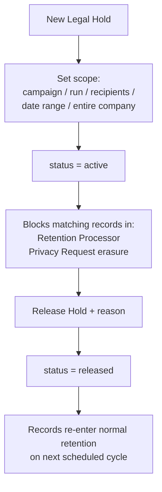

---

### 3.9 Compliance Audit Reviewer

**Mandate:** read-only, everywhere. This is the role that answers "can you reconstruct what happened to campaign X / recipient Y" without being able to change anything.

| Task | Where | Steps |
|---|---|---|
| Reconstruct a campaign's full history | Compliance → Audit → **Campaign Runs** → open one | Governance version, approval version, preflight counts, execution counts, linked archive and outcome — all in one record. |
| Inspect the immutable archive | Compliance → Audit → **Campaign Archives** | Exact-as-sent content snapshot, attachment copies (independent of the source mailing), locked + hashed. **"Verify Integrity"** button recomputes the hash live. |
| Walk the append-only event ledger | Compliance → Audit → **Send Events** | One row per lifecycle event per recipient, hash-chained (`previous_event_hash` → `event_hash`). |
| Reconstruct one recipient's decision | Compliance → Audit → **Recipient Decisions** | Eligibility status + reason code for every campaign that ever targeted them. |
| Review consent/suppression history for a contact | Compliance → Consent / Suppression menus | Full timeline, read-only. |
| Review retention/privacy evidence | Compliance → Privacy & Retention → **Retention Action Ledger** / **Privacy Requests** (read-only) | Append-only, immutable ledger of every retention decision ever made. |
| Pull an audit export | Compliance → Audit → **Audit Exports** | Same masked/full packages Compliance Admin, Operations Admin, Legal Hold Admin, and Privacy Officer can generate — Auditor can *view* existing ones. |
| Verify integrity on demand | Compliance → Audit → **Integrity Verification** | Same Campaign Archives list; the daily integrity-verification cron also runs this automatically and raises a compliance alert on any mismatch. |

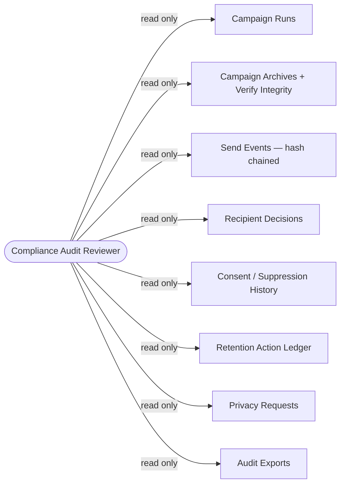

---

## 4. Suggested Live Demo Script (≈35–40 min)

Run these in order, switching the logged-in user (or browser profile) at each role change — that switch *is* the demo, since it's what proves separation of duties actually works.

1. **Author** — create a campaign, submit for content review. *(3 min)*
2. **Content Approver** — try to open it as the same person as step 1 and note self-approval is blocked if you reuse the Author's login; otherwise approve content. *(3 min)*
3. **Compliance Reviewer** — approve compliance, run preflight, show the eligible/excluded breakdown. *(5 min)*
4. **Campaign Operator** — send it, watch Active Runs, show a live outcome updating. *(5 min)*
5. *(Optional)* trigger a bounce/complaint webhook and show it landing in Compliance → Deliverability → **Delivery Events**, and the resulting suppression entry syncing to Odoo's native blacklist. *(5 min)*
6. **Compliance Audit Reviewer** — open the same campaign's Archive, click Verify Integrity, walk the Send Events for one recipient. *(5 min)*
7. **Privacy Officer** — file a privacy request for that recipient, run discovery (show it finding the send event/consent/suppression from steps 1–5), execute an erasure. *(7 min)*
8. **Legal Hold Administrator** — create a hold on that same recipient *before* releasing anything in step 7, and re-run discovery/execute to show the hold blocking it; then release the hold. *(5 min)*
9. **Compliance Administrator** / **Operations Administrator** — close with the Settings page and Dashboard, tying every number back to what was just demoed. *(3 min)*

---

## Appendix A — Setting Up Demo Users

For each role, create a `res.users` record (Settings → Users → New) and grant exactly one role on the **Access Rights** tab (under the "Email Marketing" section — see the "Compliance Level" / "Operations Level" dropdowns and the independent toggles). Suggested naming so logins are self-explanatory during a demo:

| Login | Role granted |
|---|---|
| `demo.author` | Newsletter Author |
| `demo.approver` | Content Approver |
| `demo.reviewer` | Compliance Reviewer |
| `demo.compliance.admin` | Compliance Administrator |
| `demo.operator` | Campaign Operator |
| `demo.ops.admin` | Operations Administrator |
| `demo.privacy` | Privacy Officer |
| `demo.legal.hold` | Legal Hold Administrator |
| `demo.auditor` | Compliance Audit Reviewer |

All demo users also need the standard `mass_mailing.group_mass_mailing_user` group (Email Marketing's own "User" access) to see the app at all — the Newsletter Compliance groups layer permissions on top of it, they don't replace it.

## Appendix B — Where Every Menu Lives

```mermaid
flowchart TD
    Root[Email Marketing → Compliance] --> Dash[Dashboard]
    Root --> Gov[Campaign Governance]
    Root --> Exec[Execution]
    Root --> Consent[Consent]
    Root --> Supp[Suppression]
    Root --> Deliv[Deliverability]
    Root --> Audit[Audit]
    Root --> Mon[Monitoring]
    Root --> PrivRet[Privacy & Retention]
    Root --> Config[Configuration]

    Gov --> Gov1[My Campaigns]
    Gov --> Gov2[Content Review Queue]
    Gov --> Gov3[Compliance Review Queue]
    Gov --> Gov4[Preflight Required]
    Gov --> Gov5[Ready to Send]
    Gov --> Gov6[Rejected]
    Gov --> Gov7[Approval History]

    Exec --> Exec1[Active Runs]
    Exec --> Exec2[Retry Pending]
    Exec --> Exec3[Failed Recipients]
    Exec --> Exec4[Dispatch Blocked]
    Exec --> Exec5[Completed Runs]

    PrivRet --> PR1[Privacy Requests]
    PrivRet --> PR2[Retention Policies]
    PrivRet --> PR3[Retention Action Ledger]
    PrivRet --> PR4[Retention Exceptions]
    PrivRet --> PR5[Legal Holds]

    Audit --> A1[Campaign Runs]
    Audit --> A2[Recipient Decisions]
    Audit --> A3[Send Events]
    Audit --> A4[Campaign Archives]
    Audit --> A5[Campaign Outcomes]
    Audit --> A6[Audit Exports]
    Audit --> A7[Integrity Verification]
```
