# Odoo CE Bulk Email — Functionality Playbook

**Source spec:** `Odoo CE - Bulk Email.md` (the original Community Edition architecture proposal)
**Delivered as:** `newsletter_compliance`, extending Odoo 19 Community's Contacts + Email Marketing (`mass_mailing`) apps
**Cross-referenced against:** `Newsletter Compliance Platform.md` and `Custom Module R1–R6.md` (the detailed specs the source proposal was expanded into), and the actual module source

This playbook walks through every functional area the source document (`Odoo CE - Bulk Email.md`) called for, in its own order, and shows exactly how each one was delivered — which menu, which model, which button. Where the delivered module went beyond what the source doc asked for, that's called out explicitly. Where something the source doc described was *not* built, that's called out too, honestly, rather than glossed over.

For a **role-based live demo script**, see `Newsletter Compliance Demo Playbook.md` — this document is organized by *capability*, not by *who uses it*, since that's how the source spec itself is organized.

---

## 1. Recommended Stack — What Ended Up Installed

The source doc's core recommendation was: don't rebuild what Odoo Community already gives you; add one small custom module for the compliance gaps.

| Module | Technical name | Status |
|---|---|---|
| Contacts | `contacts` | Standard, used as-is (`res.partner`) |
| Discuss/Mail | `mail` | Standard, used as-is (chatter, activities, mail infrastructure) |
| Email Marketing | `mass_mailing` | Standard, extended (not replaced) |
| Newsletter Compliance | `newsletter_compliance` | **Custom — this is the delivered module** |
| Website | `website` | **Still not installed** — see below |

*Update:* the source doc's §21–22 (public subscribe page, double opt-in) has since been delivered — but deliberately **without** adding the `website` dependency. The module already had a working pattern for a public, unauthenticated page (the unsubscribe controller), so the subscribe form and confirmation flow were built the same way: a plain `auth="public"` HTTP controller, not a `website` app page. Same functional outcome, smaller footprint. See §16 below for the details.

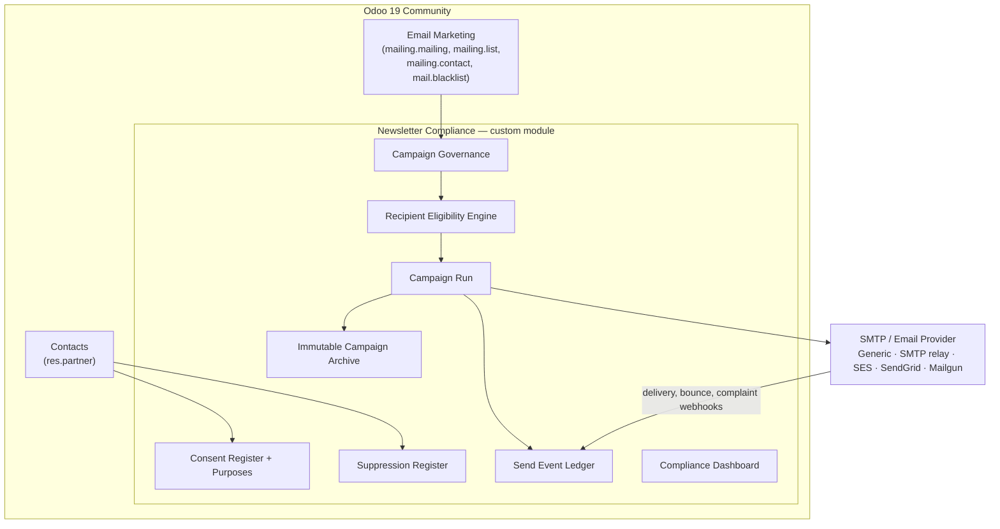

---

## 2. Recipient Sourcing

**Source doc §3** called for recipients sourced from Contacts + Mailing Lists, with custom segmentation fields (Brand, Recipient Type, Segment, Region, Country, Language, Communication Category).

**Delivered:**
- Recipients are sourced the standard Odoo way — `res.partner` records, optionally grouped into `mailing.list`/`mailing.contact`, or targeted directly by domain filter on the mailing itself (both paths are supported; our test campaigns use the domain-filter path most often).
- **Brand** (`newsletter.campaign.brand`) was built as its own model rather than a plain field — it carries its own From/Reply-To/physical address identity, independent of any one campaign (Email Marketing → Compliance → Configuration → **Brands**).
- *Update:* **Recipient Type**, **Segment**, and **Region** are now dedicated fields on `res.partner` (`newsletter_recipient_type` Selection, `newsletter_segment` Char, `newsletter_region` Char — Contacts → a contact → **Newsletter Compliance** tab), usable directly in a mailing's recipient domain filter. Country and Language still use `res.partner`'s native fields rather than duplicates.
- CSV import of recipients works exactly as standard Odoo Contacts import — no customization needed or added.

---

## 3. Consent Purpose Master

**Source doc §4** — `newsletter.consent.purpose`, one purpose selected per mailing.

**Delivered exactly as specified**, at Email Marketing → Compliance → Configuration → **Consent Purposes**:

| Source doc field | Delivered field | Notes |
|---|---|---|
| Code | `code` | Unique per company |
| Name | `name` | |
| Description | `description` | |
| Brand | *(not a direct field on Purpose)* | Brand lives on the campaign/mailing instead, since one purpose can span multiple brands |
| Privacy Notice Version | `privacy_notice_version` | Carried onto every Consent Record created under this purpose |
| Requires Explicit Consent | `requires_explicit_consent` | |
| Retention Days | `retention_days` | Informational reference field — the actual enforcement mechanism is the R6 Retention Policy engine (§9 below), which is more expressive than a single day-count |
| Active | `active` | |
| Company | `company_id` | |

Every mailing must select exactly one Consent Purpose, exactly as specified — this is a required field on the extended `mailing.mailing` model (§5 below), and preflight refuses to evaluate a mailing without one.

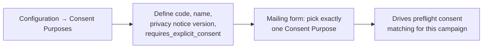

---

## 4. Consent Register

**Source doc §5** — the append-only evidence ledger, `newsletter.consent.record`. This is the exact model the source doc asked for, field for field:

| Source doc field | Delivered field |
|---|---|
| Consent ID | `reference` (auto-sequenced, `CONS-000123` format) |
| Contact | `partner_id` |
| Email | `email_normalized` (+ `email_original` retained) |
| Purpose | `purpose_id` |
| Status | `status` |
| Consent Given | `given_at` |
| Source | `source` |
| Channel | `channel` |
| Privacy Notice Version | `privacy_notice_version` |
| Evidence | `evidence_attachment_id` |
| Expiry Date | `expires_at` |
| Withdrawal Date | `withdrawn_at` |
| Withdrawal Reason | `withdrawal_reason` |

States delivered exactly as specified: **Pending → Active → {Withdrawn, Expired, Invalidated, Superseded}**. The "never overwrite historical consent" rule from the source doc is enforced in code, not just convention — `write()` is blocked on any finalized record's evidence fields, and `unlink()` is blocked entirely once a record leaves `pending`. Re-consent creates a brand new `CONS-xxx` record (`supersedes_id` links it back) rather than mutating the old one — exactly the CONS-001 → CONS-002 example the source doc walks through.

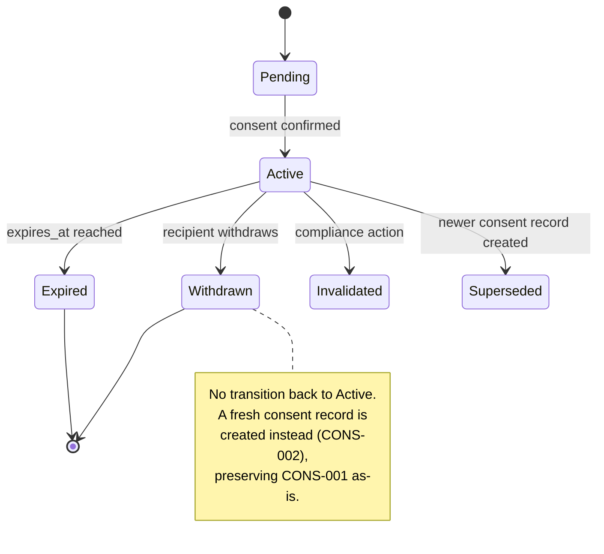

---

## 5. Contact Screen — Consent/Suppression Visibility

**Source doc §6** asked for `Consents 3 · Campaigns 14 · Suppressions 1` smart buttons on the Contact form, plus a per-purpose eligibility table (✓ Allowed / ✕ Suppressed / ✕ No Consent).

**Delivered:** four smart buttons on `res.partner` (not three — a fourth was added):

| Button | Links to |
|---|---|
| **Consents** | This contact's full `newsletter.consent.record` history |
| **Suppressions** | This contact's full `newsletter.suppression.entry` history |
| **Send History** | Every `newsletter.send.event` this contact was ever part of |
| **Deliverability** *(added beyond the source doc)* | Their `newsletter.delivery.reputation` record — bounce/complaint counts and current reputation state |

*Update:* the source doc's mockup of a live per-purpose ✓/✕ eligibility table is now delivered as a computed grid on the contact form itself — Contacts → a contact → **Newsletter Compliance** tab → **Communication Eligibility**. It lists every active consent purpose with a live Allowed/Suppressed/No Consent status (a global or purpose-scoped suppression always overrides an otherwise-active consent in what's displayed), computed on the fly rather than stored, so it never goes stale.

---

## 6. Campaign / Mailing Extension

**Source doc §7** — extend `mailing.mailing` rather than build a parallel campaign model. Delivered exactly that way; every field the source doc listed exists (plus governance/approval fields added in the later R2 spec that the source doc's simpler version didn't anticipate needing):

| Source doc field | Delivered field |
|---|---|
| Campaign Compliance ID | `compliance_campaign_id` |
| Brand | `brand_id` |
| Consent Purpose | `consent_purpose_id` |
| Compliance State | `compliance_state` |
| Compliance Owner | `compliance_owner_id` / `business_owner_id` |
| Content Approved By/At | `content_approved_by_id` / `content_approved_at` |
| Compliance Approved By/At | `compliance_approved_by_id` / `compliance_approved_at` |
| Preflight Status | `preflight_status` |
| Targeted/Eligible/Excluded Count | `preflight_targeted_count` / `_eligible_count` / `_excluded_count` |
| Archive Record | `current_campaign_run_id.archive_id` |

---

## 7. Campaign Workflow & Governance Roles

**Source doc §8–9** — since Community has no Studio approval-rule builder, the workflow is enforced entirely in the module's own code, and four roles govern it (Newsletter Author, Content Approver, Compliance Reviewer, Campaign Operator — plus five more roles added in the R2/R6 expansion: Compliance Administrator, Compliance Audit Reviewer, Operations Administrator, Privacy Officer, Legal Hold Administrator).

The state machine delivered matches the source doc's almost exactly, with the terminal states it called for (Rejected, Cancelled, Suspended, Failed) all present:

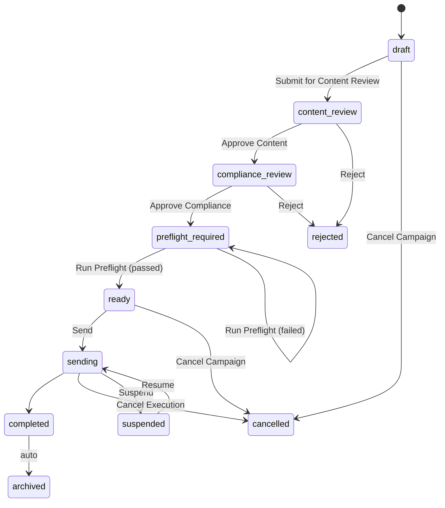

The source doc's exact enforcement rule — *"the Send action must be disabled server-side unless `state = ready_to_send AND preflight_status = passed`, this is much stronger than relying on UI visibility"* — was delivered precisely: `action_start_execution()` checks `compliance_state == "ready"`, `run.state == "passed"`, and `run.frozen` server-side, and additionally checks the preflight hasn't gone stale past a configurable age (a control the source doc didn't anticipate but the later R6 config work added). A direct RPC call bypassing the UI is blocked by these same checks — this is covered by an automated test (`test_send_enforcement.py`) specifically simulating an RPC bypass attempt.

Self-approval prevention (*"Author cannot approve own content"*) is likewise a server-side check, not a UI hide: `action_approve_content()` explicitly raises if `business_owner_id == self.env.user`.

---

## 8. Preflight Eligibility Engine

**Source doc §10–11** — the central control. Delivered as `newsletter.recipient.eligibility`, one row created per candidate recipient at preflight time.

The evaluation order delivered matches the source doc's decision tree, with two additional checks the source doc's simplified version omitted (duplicate detection and a company-access check, both present in the fuller R3 spec):

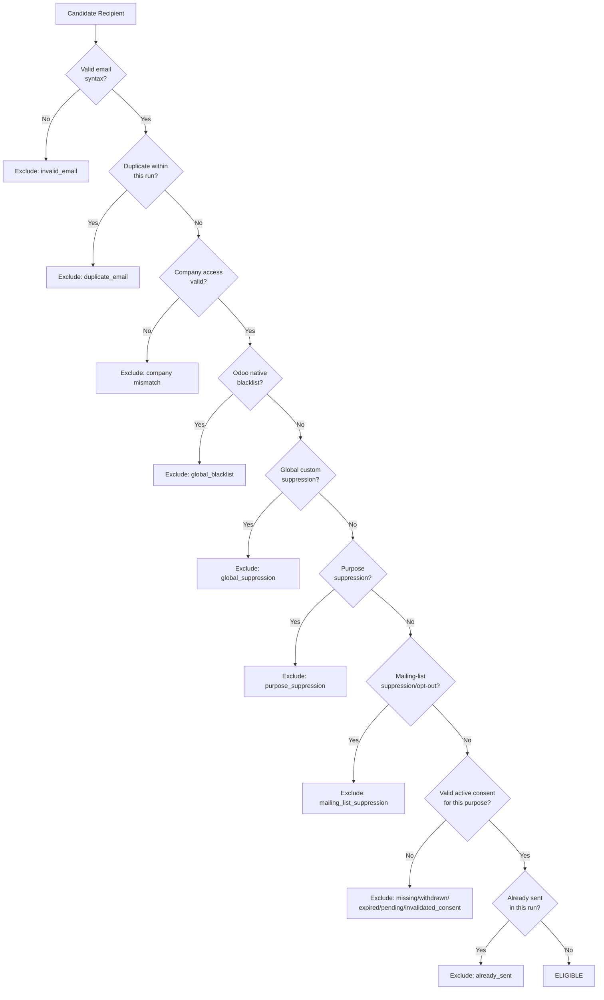

The **preflight result screen** the source doc mocked up (targeted/eligible/missing-consent/withdrawn/blacklist/suppression/invalid/duplicate/already-sent counts, each clickable to drill into the underlying records) is delivered on the Campaign Run's Preflight tab — every count the source doc listed is a real stored field on `newsletter.campaign.run`, and Email Marketing → Compliance → Audit → **Recipient Decisions** is exactly the drill-through list the source doc asked for ("click Missing Consent: 620 and inspect those 620 records").

One invariant the source doc didn't state explicitly but the delivered engine enforces and self-checks: **Targeted = Eligible + Excluded**, exactly. If a preflight run's counts don't reconcile, the run is marked `failed` rather than silently proceeding.

---

## 9. Suppression Register & Reasons

**Source doc §12–13** — `newsletter.suppression.entry`, supplementing (not replacing) Odoo's native blacklist, with the exact scope model the source doc's healthcare-vs-promotional example calls for.

| Source doc scope | Delivered |
|---|---|
| GLOBAL | ✅ `scope = "global"` |
| BRAND | ✅ `scope = "brand"` (blocks every campaign under one `newsletter.campaign.brand`) |
| PURPOSE | ✅ `scope = "purpose"` |
| MAILING LIST | ✅ `scope = "mailing_list"` |
| CAMPAIGN | ✅ `scope = "campaign"` (blocks one specific `mailing.mailing` only — the narrowest scope, e.g. "don't resend me this one newsletter") |

All five scopes from the source doc are now delivered. Precedence, broadest to narrowest, matches the source doc's own listed order: **Global > Brand > Purpose > Mailing List > Campaign**, computed in `suppression_service.get_applicable_suppressions_by_email()` — a stronger (broader) scope always overrides a weaker one that also matches. Brand and Campaign suppressions never sync to Odoo's native blacklist, same as Purpose/Mailing List.

The 11 suppression reasons the source doc listed are delivered as a controlled master list (not free text), Email Marketing → Compliance → Configuration → **Suppression Reasons**: `UNSUBSCRIBE`, `GLOBAL_OPT_OUT`, `HARD_BOUNCE`, `SOFT_BOUNCE_LIMIT`, `COMPLAINT`, `INVALID_ADDRESS`, `LEGAL_HOLD`, `COMPLIANCE_HOLD`, `PURPOSE_OPT_OUT`, `MANUAL`, `DATA_QUALITY` — matching the source doc's list almost one-for-one (it also lists "Legal Restriction" and "Other" as separate reasons; those are covered by `LEGAL_HOLD`/`COMPLIANCE_HOLD` and `MANUAL`/`DATA_QUALITY` respectively rather than as distinct codes).

The healthcare-vs-promotional worked example from the source doc is exactly how the module behaves: a `PURPOSE_OPT_OUT` suppression scoped to the Promotional purpose leaves the same recipient fully eligible for a Healthcare-purpose campaign.

Two-way native blacklist sync — an enhancement beyond what the source doc described — was built on top: a `global` suppression whose reason is bounce/complaint-category (or the `GLOBAL_OPT_OUT` code) automatically pushes to `mail.blacklist`, and additions to the native blacklist automatically create a matching suppression entry, with loop-prevention via context flags. Purpose/list-scoped suppressions deliberately never reach the native blacklist — exactly the source doc's requirement that they "remain scoped."

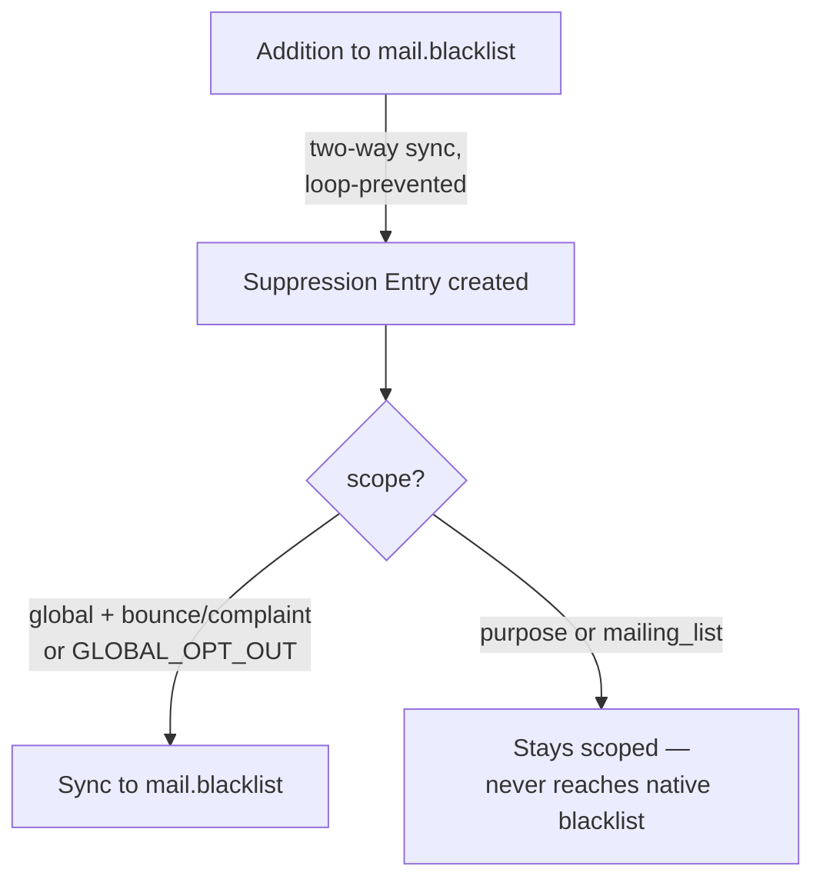

---

## 10. Bounce Rules

**Source doc §14** — delivered exactly as specified, plus live delivery-feedback processing that the source doc's simplified version assumed but didn't detail:

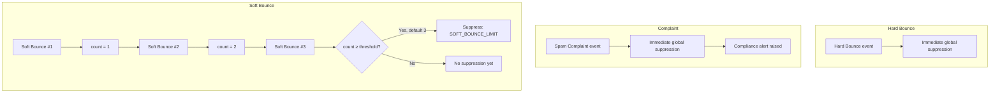

The soft-bounce threshold is configurable exactly as the source doc asked (`Soft Bounce Threshold = 3` by default, Settings → Newsletter Deliverability), and — beyond what the source doc described — the counter resets automatically once a *delivered* event arrives after a soft bounce, rather than accumulating forever. A single soft bounce never globally suppresses, matching the source doc's explicit caution against that.

---

## 11. Campaign Run

**Source doc §15** — exactly delivered as `newsletter.campaign.run`, giving the AUG-2026/SEP-2026/OCT-2026 recurring-campaign traceability the source doc's example calls for. Every count field the source doc listed is present (Targeted, Eligible, Excluded, Sent, Delivered, Bounced, Complained, Unsubscribed, Failed), plus execution-state fields (`queued_count`, `retry_pending_count`, `blocked_at_dispatch_count`, `cancelled_count`) that the source doc's simpler version didn't need to distinguish.

---

## 12. Send Event Ledger

**Source doc §16** — delivered as `newsletter.send.event`, append-only (write/unlink both raise `UserError` unconditionally), with every field the source doc listed:

| Source doc field | Delivered field |
|---|---|
| Event ID | `reference` |
| Campaign Run | `campaign_run_id` |
| Recipient | `partner_id` / `mailing_contact_id` |
| Email | `email_normalized` |
| Event Type | `event_type` |
| Timestamp | `event_timestamp` |
| Message ID | `provider_message_id` |
| Attempt | `attempt_number` |
| Provider Response | `error_message` / `error_code` (on failure events) |
| Reason | `reason` (on exclusion/failure events) |

All 14 event types the source doc listed are present (`eligibility_passed`, `eligibility_excluded`, `queued`, `sent`→ split into `send_accepted`/`send_failed`, `delivered`, `delivery_delayed`, `soft_bounce`, `hard_bounce`, `complaint`, `unsubscribed`, `suppression_created`, `retry_scheduled`, `campaign_completed`), plus event-chain integrity hashing (`previous_event_hash`/`event_hash`) that goes beyond what the source doc specified — each event's hash incorporates the previous one, so the whole chain for a campaign run can be verified in one pass and any single altered row breaks verification from that point forward.

---

## 13. Recipient Timeline & Audit Reconstruction

**Source doc §17** — the John Smith example (consent granted → four campaigns with mixed delivery outcomes → withdrawal → purpose suppression → subsequent exclusion) is exactly what the delivered module reconstructs, via:

- The contact's **Consents** and **Suppressions** smart buttons (chronological, immutable)
- The contact's **Send History** smart button (every `newsletter.send.event` involving them)
- Email Marketing → Compliance → Audit → **Recipient Decisions**, showing the eligibility status *and reason* for every campaign that ever targeted them — including "Excluded: Consent Withdrawn" exactly as the source doc's timeline example shows

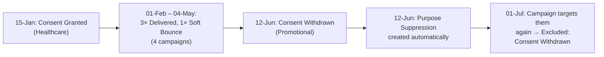

---

## 14. Campaign Archive & Locking

**Source doc §18–19** — delivered as `newsletter.campaign.archive`, capturing every field the source doc's four groups asked for (Campaign identity, Content, Audience, Execution, Results), plus the two integrity fields it specified (SHA-256 content hash, archive hash, locked flag, created-at).

The exact locking mechanism the source doc's pseudocode showed — `write()` raising `UserError` when `locked` — is delivered verbatim in spirit (`if self.filtered("locked"): raise UserError(...)`), with `unlink()` blocked unconditionally too, not just gated by a flag. One deliberate refinement beyond the source doc: after locking, a narrow allowlist of retention-mixin fields (`retention_policy_id`, `retain_until`, `legal_hold`, …) can still be written, so the retention/legal-hold engine (an R6 addition the source doc predates) can operate on an archive without ever touching its evidentiary content.

Also beyond the source doc's description: attachments referenced by the archive are **copied** into independent `ir.attachment` records at archive time, not merely referenced — editing or deleting the original mailing's attachment afterward cannot alter what the archive shows.

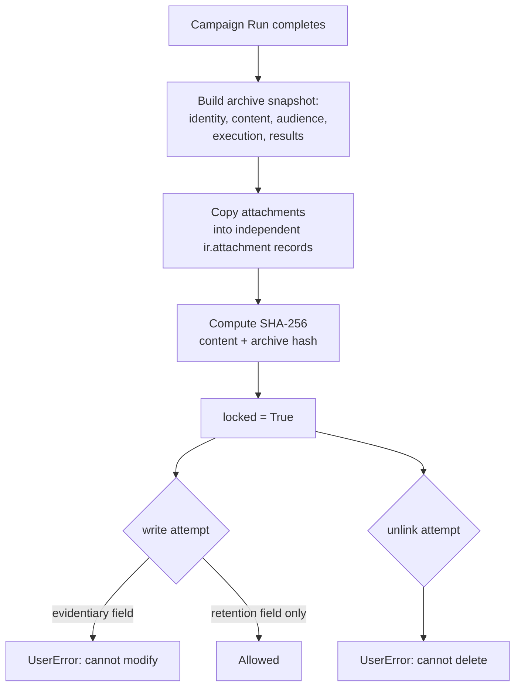

---

## 15. Unsubscribe Flow

**Source doc §20** — "use Odoo's existing unsubscribe capability as the front door, then extend the outcome into Withdraw Consent + Suppression Entry + Send-event log."

Delivered with one structural difference: rather than depending on `mass_mailing`'s built-in unsubscribe page, the module ships its **own** public unsubscribe endpoint (`/newsletter-compliance/unsubscribe/<token>`), reachable from a link embedded in every outbound send (and RFC 8058 one-click `List-Unsubscribe` headers) — because the module needed a three-way choice (newsletter-only / this-purpose / all-marketing) that goes beyond Odoo's native single-purpose opt-out:

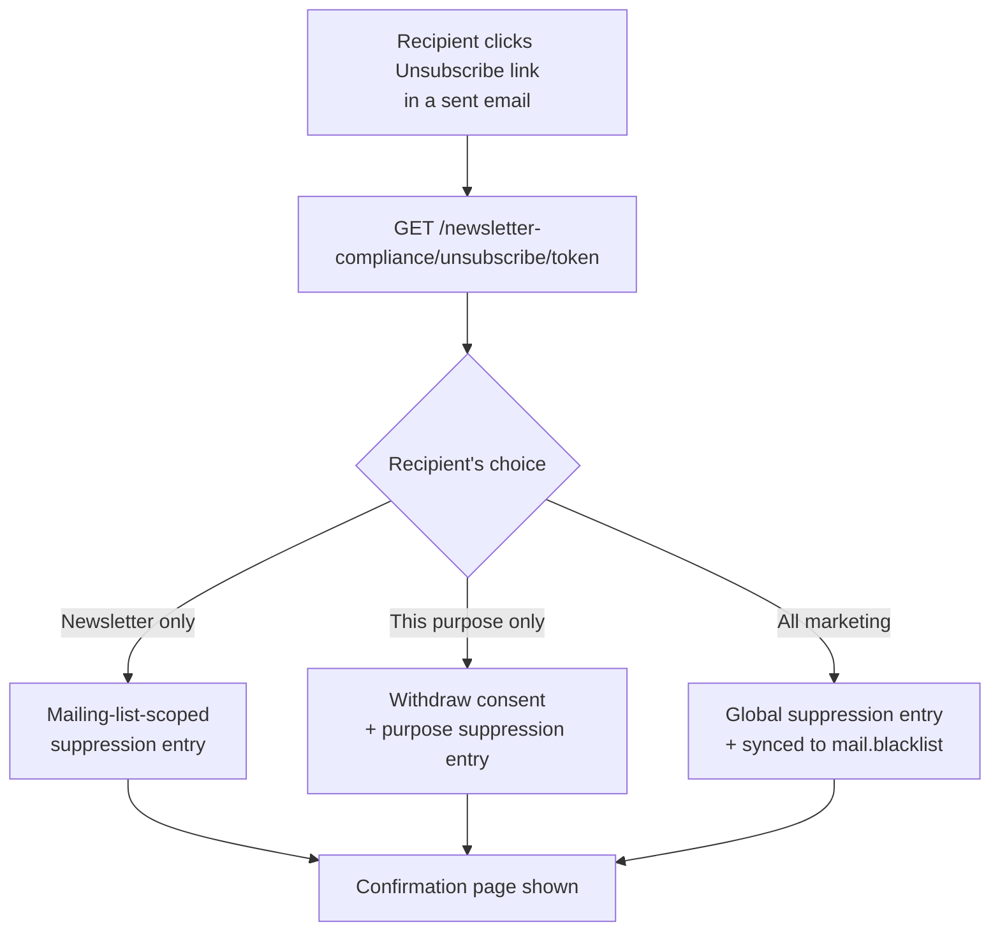

The outcome the source doc asked for — withdrawal + suppression entry, both traceable in the send-event log — is delivered; the front door is custom rather than reusing `mass_mailing`'s, specifically because the source doc's own later requirement (purpose-scoped suppression, not just global) needed a choice `mass_mailing`'s native unsubscribe page doesn't offer.

---

## 16. Public Consent Collection & Double Opt-In

**Source doc §21–22** described a public Website-based subscription form (per-purpose checkboxes, privacy notice version, explicit consent checkbox) and a double opt-in flow (Pending → confirmation email → recipient clicks Confirm → Active).

**Delivered — without the `website` dependency.** Rather than building a `website`-app page, the module reused the same pattern already proven by the unsubscribe controller: a plain, unauthenticated `type="http", auth="public"` route.

| Route | Purpose |
|---|---|
| `GET /newsletter-compliance/subscribe` | Public form: email, first/last name, one checkbox per `public_subscribe`-flagged Consent Purpose (with its privacy notice version shown), explicit consent checkbox |
| `POST /newsletter-compliance/subscribe` | Finds-or-creates the `res.partner` by email, creates one **PENDING** consent record per selected purpose (all sharing one confirmation token), emails a confirmation link |
| `GET /newsletter-compliance/subscribe/confirm/<token>` | Activates every pending record sharing that token (`given_at` stamped at confirmation, not at submission) |

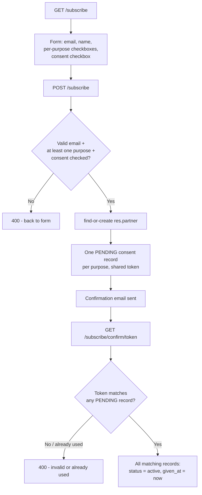

A `newsletter.consent.purpose` only appears on the public form if its new `public_subscribe` field is checked (Configuration → Consent Purposes) — internal-only purposes can be excluded from public self-service while still being assignable internally. An unconfirmed (pending) consent record is never treated as valid consent by the eligibility engine or privacy discovery — confirmation is the only path from Pending to Active, matching the source doc's flow exactly.

The one thing genuinely still missing relative to a full production build: the confirmation email uses a plain `mail.mail` with an inline HTML body, not a themed `mail.template` — cosmetic, not functional.

---

## 17. Scheduling Without Marketing Automation

**Source doc §23** — "Marketing Automation isn't available in Community; you don't need it. Use Email Marketing's own scheduling + `ir.cron` for the small subset of automation you actually need."

Delivered — and the actual list of scheduled jobs ended up larger than the source doc's illustrative list (`Consent expiry, Retention processing, Campaign scheduling checks, Bounce escalation, Statistics reconciliation, Archive generation`), because R4–R6 added dispatch execution and privacy/retention automation the source doc's simplified version didn't yet anticipate:

| Cron | Frequency | Covers source doc's... |
|---|---|---|
| Campaign Dispatch Worker | 1 min | (execution — added in R4, beyond source doc scope) |
| Provider Event Processor | 1 min | "Bounce escalation" |
| Provider Health Monitor | 10 min | "Statistics reconciliation" (backlog/unmatched-event health) |
| Campaign Outcome Finalization | 1 hour | "Statistics reconciliation" |
| Retention Processor | Daily | "Retention processing" |
| Retention Exception Monitor | Daily | (added in R6, beyond source doc scope) |
| Privacy Request Overdue Monitor | Daily | (added in R6, beyond source doc scope) |
| Integrity Verifier | Daily | (added in R6, beyond source doc scope) |
| Audit Export Cleanup | Daily | (added in R6, beyond source doc scope) |
| **Consent Expiry** | **Daily** | **"Consent expiry"** |

"Campaign scheduling checks" is still handled entirely by `mass_mailing`'s own native scheduling (not reimplemented, and doesn't need to be). "Consent expiry" is now a real cron (`newsletter.consent.record._cron_expire_consents()`) that proactively sweeps active consent records past their `expires_at` and stamps them `expired`. Worth being precise about what this cron actually changes: expiry was *already* honored correctly before this cron existed — `consent_service.get_effective_consents_by_email()` checks `expires_at` live in its domain, so an expired-but-still-`status=active` record was never treated as valid consent. The cron's job is purely to keep the stored `status` field itself accurate for reporting/browsing, not to fix a correctness gap.

---

## 18. Menu Map — Source Doc's Proposal vs. Delivered

The source doc's §24 menu sketch and the delivered menu are close, with three extra top-level sections (Execution, Deliverability, Monitoring, Privacy & Retention) that emerged once R4–R6 added campaign execution, live delivery feedback, and the privacy/retention engine:

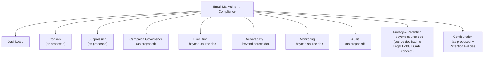

The source doc's Configuration sub-menu asked for **Retention Policies** and **Compliance Settings** alongside Consent Purposes/Suppression Reasons/Brands — delivered as **Privacy & Retention → Retention Policies** (its own section, since retention grew into a full engine) and **Settings → Newsletter Deliverability** respectively, rather than nested under Configuration itself.

---

## 19. Standard vs. Custom — Updated Capability Matrix

The source doc's closing table (§25), filled in with what actually shipped rather than what was planned:

| Capability | Odoo CE (standard) | Custom (delivered) | Notes |
|---|---|---|---|
| Newsletter editor | ✅ | | |
| Mailing list | ✅ | | |
| Email send | ✅ | | Extended with compliance gating + multi-provider dispatch |
| Scheduling | ✅ | | Extended with `ir.cron` execution/retry |
| Personalization | ✅ | | |
| Basic unsubscribe | ✅ | Replaced | Custom 3-choice unsubscribe front door (§15) |
| Standard blacklist | ✅ | Extended | Two-way sync with custom Suppression Register |
| Basic statistics | ✅ | | |
| Contacts | ✅ | Extended | 4 smart buttons + segmentation fields + eligibility grid added |
| Purpose-specific consent | | ✅ | |
| Consent evidence | | ✅ | |
| Compliance approvals | | ✅ | |
| Preflight eligibility | | ✅ | |
| Scoped suppression | | ✅ | Global/Brand/Purpose/List/Campaign — all five source-doc scopes |
| Soft-bounce policy | | ✅ | |
| Complaint management | Partial | ✅ | Full webhook-driven ingestion pipeline |
| Campaign-run model | | ✅ | |
| Recipient event ledger | Partial | ✅ | Hash-chained, append-only |
| Immutable archive | | ✅ | Including copied attachment evidence |
| Compliance dashboard | | ✅ | |
| Retention governance | | ✅ | Full policy engine, not just a day-count field |
| Public consent collection | | ✅ | Custom `auth="public"` controller, no `website` dependency — see §16 |
| Double opt-in | | ✅ | Pending → confirmation email → Active — see §16 |
| Consent expiry automation | | ✅ | Daily cron, on top of the pre-existing live expiry check |
| Contact segmentation fields | | ✅ | Recipient Type / Segment / Region on `res.partner` |
| Legal hold | | ✅ *(beyond source doc)* | Source doc never described this |
| Privacy/DSAR request handling | | ✅ *(beyond source doc)* | Source doc never described this |
| Pseudonymization / erasure | | ✅ *(beyond source doc)* | Source doc never described this |
| Multi-provider delivery adapters | | ✅ *(beyond source doc)* | Generic, SMTP relay, SES, SendGrid, Mailgun |

All six gaps identified in the first pass of this playbook have since been closed. Only one intentionally-scoped simplification remains anywhere in this document: the confirmation email in §16 uses a plain inline-HTML `mail.mail` rather than a themed `mail.template` — cosmetic, not functional.
